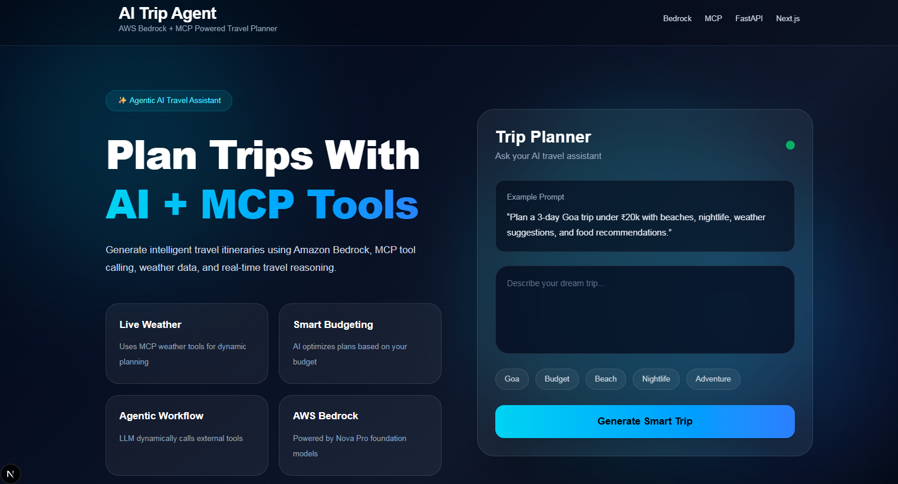
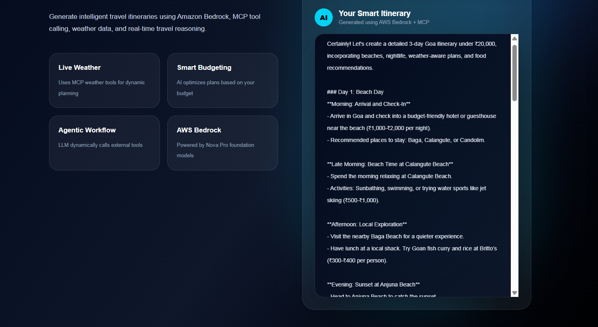

# ✈️ AI Trip Agent

<div align="center">

### 🧠 AI-Powered Travel Planner using AWS Bedrock + MCP

Generate intelligent travel itineraries with live weather insights, budget optimization, nightlife recommendations, and real-time AI planning.

<br>


</div>

---

# 🌟 Overview

AI Trip Agent is a smart travel planning assistant that combines:

- 🧠 **Amazon Bedrock (Nova Pro)** for AI itinerary generation
- 🌦️ **MCP Weather Tools** for real-time weather-aware planning
- ⚡ **FastAPI Backend** for AI orchestration
- 🎨 **Next.js Frontend** for a modern responsive experience

The application creates detailed travel plans based on:
- Budget
- Weather
- Nightlife
- Food preferences
- Adventure activities
- Trip duration


# 🏗️ Project Flow

```text
Frontend UI
   ↓
FastAPI Backend
   ↓
Agent Logic
   ↓
MCP Weather Tool
   ↓
Real Weather Data
   ↓
Amazon Bedrock
   ↓
Final AI Itinerary
```

---

# 📸 Screenshots

---

## 🏠 Landing Page

<div align="center">



</div>

---

## 🤖 Smart AI Generated Itinerary

<div align="center">



</div>

---

# ✨ Features

<table>
<tr>
<td width="50%">

### 🧠 AI Trip Planning
- AI-generated itineraries
- Smart activity recommendations
- Personalized trip suggestions

</td>

<td width="50%">

### 🌦️ Live Weather Support
- MCP weather tools
- Real-time weather insights
- Weather-aware recommendations

</td>
</tr>

<tr>
<td width="50%">

### 💰 Budget Optimization
- Budget-friendly suggestions
- Cost-aware travel planning
- Smart expense balancing

</td>

<td width="50%">

### ⚡ Modern UI
- Responsive design
- Beautiful gradients
- Interactive interface

</td>
</tr>
</table>

